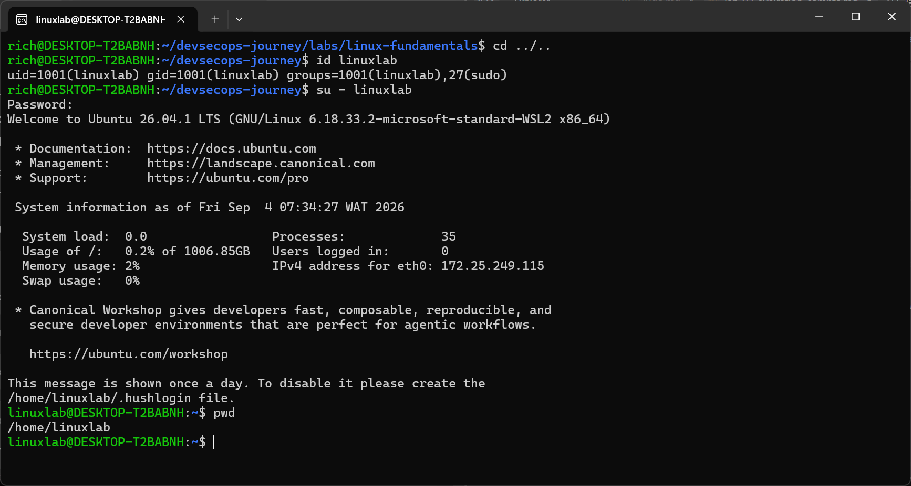

# Lab 01 — Utilisateurs et sudo

## Objectif

Créer un utilisateur, lui attribuer un mot de passe, lui donner accès à sudo et vérifier ses privilèges.

## Environnement

- Système : Ubuntu WSL2
- Utilisateur principal : `rich`
- Utilisateur créé : `linuxlab`

## Commandes exécutées

## whoami
 pour verifier avec quel utilisateur je suis entrain de travailler.

## sudo useradd -m -s /bin/bash linuxlab
pour creer le nouvel utilisateur linuxlab
{
    -sudo: execute la commande avec les privileges admin
    -useradd: commande qui cree le user
    -(-m): commande qui permet de creer un dossier personnel /home/linuxlab
    -(-s /bin/bash): configure bash comme shell
    -linuxlab: nom du nouvel utilisateur
}
## sudo passwd linuxlab
commande pour definir le mot de passe de l'utilisateur linuxlab

## sudo usermod -aG sudo linuxlab
commande pour autoriser l'utilisateur a utiliser SUDO
{
    -usermod: modifie un utilisateur existant
    -(-G sudo): ajoute l'utilisateur au groupe SUDO
    -(-a): conserve ses autres groupes et ajoute le nouveau // il est tres important, sans lui il pourra avoir remplacement des autres groupes de l'utilisateur.
}
## groups linuxlab
pour verifier les differents groupes de l'utilisateur

## su - linuxlab
commande qui permet de passer sur le nouveau compte/changer d'utilisateur.

## whoami
## pwd
pour verifier son dossier

## ls /root
commande pour consulter le dossier personnel de root// nb: on teste sans SUDO pour confirmer que cela est impossible car un utilisateur ordinaire ne peut pas consulter le dossier personnel de root

## sudo ls -la /root
commande pour consulter le dossier personnel de root

## sudo whoami
## exit
pour sortir du compte linuxlab

