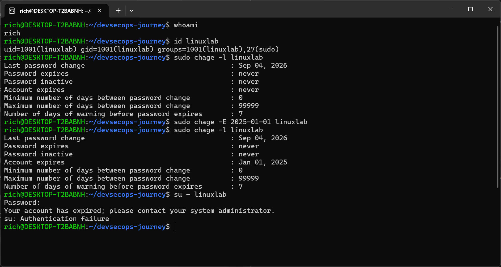
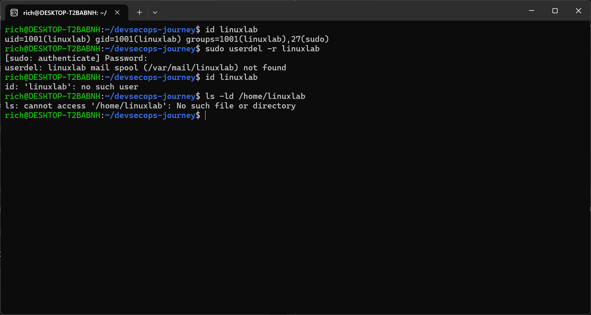

# Lab 02 — Ancienneté du mot de passe et expiration du compte

## Objectif

Examiner les informations d’ancienneté du mot de passe, faire expirer le compte et vérifier les conséquences.

## Environnement

- Système : Ubuntu WSL2
- Utilisateur principal : `rich`
- Utilisateur créé : `linuxlab`

## Commandes exécutées

## whoami
## id linuxlab
verification de l'existence de l'utilisateur avec lequel on souhaite faire le lab2

## sudo chage -l linuxlab
{
    -(-l): list: afficher les informations
    -chage:(change age)permet de modifier l'anciennete et l'expiration d'un mdp ou d'un compte
}
cette commande permet d'examiner l'anciennete du mot de passe .

## sudo chage -E 2025-01-01 linuxlab
{
    -sudo: execute la commande avec les privileges admin
    -chage: gere l'anciennete et l'expiration
    -(-E): definit la date d'expiration du compte
    -2025-01-01: date deja depassee;
    -linuxlab: user concerne.
}
cette commande permet de modifier la date d'expiration du compte.
NB: en utilisant (-M) a la place de (-E) on peut modifier la duree maximale du mdp

## sudo chage -l linuxlab
pour verifier les infos qui ont ete modifiees

## su - linuxlab
pour tester si la connexion a linuxlab est toujours possible

## Suppression de l’utilisateur de test

## exit
pour quitter la session linuxlab

## id linuxlab
verifier l'existance de l'utilisateur que l'on souhaite supprimer// la commande id affiche les information concernant un user(sont UID(identifiant utilisateur), GID(son groupe principal), ses groupes supplementaire)

## ls -ld /home/linuxlab
{
    -ls: affiche les informations sur un fichier ou un dossier
    -(-l): utilise un affichage detaille
    -(-d): affiche les informations du dossier lui meme au lieu d'afficher son contenu
    -/home/linuxlab est le dossier personnel de l'utilisateur
}
cette verification permet de confirmer  le dossier qui sera supprime.

## sudo userdel -r linuxlab
{
    -sudo: execute la commande avec les privileges root
    -userdel: supprime un compte utilisateur
    -(-r): supprime egalement son dossier personnel et ses fichiers associes.
    -linuxlab: l'utilisateur cible
}
sans l'option (-r), le compte serait supprime, mais le dossier /home/linuxlab pourrait rester present.
cette commande est destructive: le contenu de /home/linuxlab est supprime. il faut donc toujours verifier le nom de l'utilisateur avant de l'executer.

## id linuxlab
pour verifier que l'utilisateur a bien ete supprime// id: ‘linuxlab’: no such user

## ls -ld /home/linuxlab
verifier que son dossier a ete supprime// ls: cannot access '/home/linuxlab': No such file or directory
