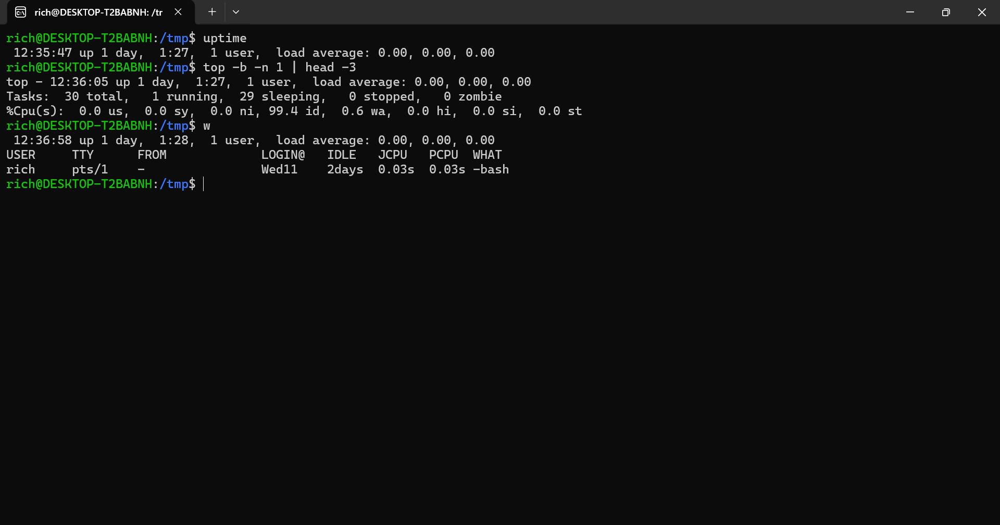

# Lab 06 — Obtenir la duree de fonctionnement et les moyennes de charge

## Objectif

determiner depuis combien de temps notre systeme est en running et afficher les moyennes de charge

## Commandes exécutées

## uptime
affiche depuis combien de temps le systeme tourne sans interuption, le nombre de users connectes et la charge moyenne du processeur sur les 1, 5 et 15 dernieres minutes.

## top -b -n 1 | head -3
combinaison de plusieurs outils avec un pipe(|)
{
    -<top>: affiche les statistiques du systeme et les processus en temps reel
    -<-b>: (batch mode), Lance <top> en mode texte brut pour pouvoir envoyer son resultat a d'autres commandes. c'est indispensable lorsque on veut traiter le resultat avec d'autres commandes.
    -<-n 1>: Demande a <top> de ne faire qu'une seule capture instantanee puis de s'arreter(au lieu de rafraichir l'ecran en continu)
    -<| head -3>: redirige la sortie pour n'afficher que les 3 premieres lignes du resultat
}

## w
affiche qui est actuellement connecte au systeme, depuis quel terminal, l'heure de connexionn, ainsi que la commande qu'il est en train d'executer.

