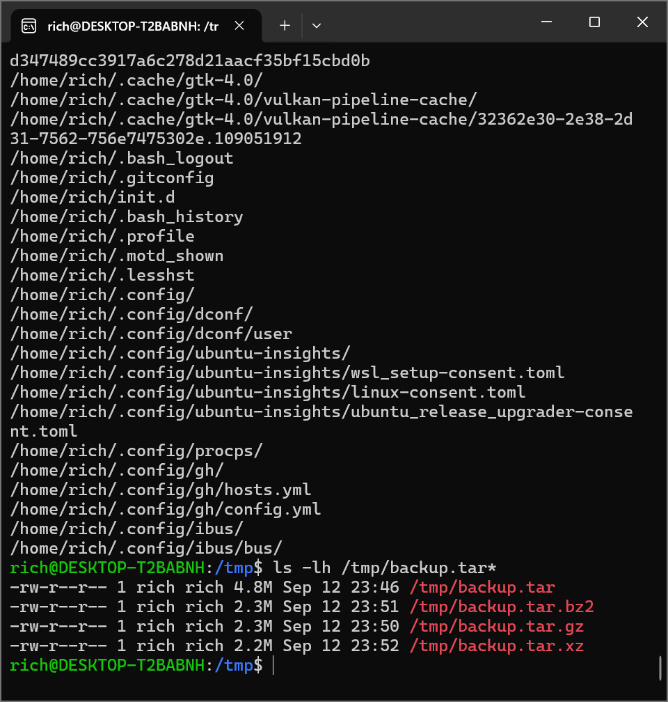

# Lab 06 —archivage(sauvegarde) du repertoire personnel

## Objectif
Archiver (ou sauvegarder) régulièrement vos fichiers est une bonne pratique. Vous pourriez, par exemple, saisir une commande et écraser involontairement des fichiers importants que vous ne vouliez pas modifier.

De plus, même si votre matériel est considéré comme relativement fiable, tout appareil finit par tomber en panne (ne serait-ce qu'une simple coupure de courant inattendue). Bien souvent, cela arrive au pire moment. Il est donc judicieux de prendre l'habitude de sauvegarder régulièrement vos fichiers.

Il est bien sûr important d'effectuer des sauvegardes sur des systèmes externes via un réseau ou sur un support de stockage externe, comme un disque dur externe ou une clé USB. Ici, nous allons créer une archive de sauvegarde sur le même système, ce qui est très utile, mais ne servira à rien en cas de panne catastrophique du disque dur, de vol de votre ordinateur ou de destruction du bâtiment par un astéroïde ou un incendie.

Commencez par sauvegarder tous les fichiers et sous-répertoires de votre répertoire personnel à l'aide de tar . Placez l'archive tar obtenue dans le répertoire /tmp et nommez-la backup.tar .

Deuxièmement, accomplissez la même tâche avec la compression gzip en utilisant l' option -z de tar , créant /tmp/backup.tar.gz .

Comparez la taille des deux fichiers (avec ls -l ).

Pour une expérience supplémentaire, effectuez des sauvegardes en utilisant l' option  -j avec la compression bzip2 , et l'option -J avec la  compression xz .

## commandes executees

## tar -cvf /tmp/backup.tar ~
{
    -c: creer
    -v: afficher les fichiers
    -f: specifier le fichier de destination
}
cette commande permet d'archiver l'integralite du repertoire /home/rich

## tar -czvf /tmp/backup.tar.gz ~
{
    -z: pour compresser l'archive au format .tar.gz
}
cette commande permet la sauvegarde et la compression(gzip)

##  tar -cjvf /tmp/backup.tar.bz2 ~ et tar -cJvf /tmp/backup.tar.xz ~
{
    -j: pour compresser l'archive au format bzip2
    -J: pour compresser l'archive au format xz
}
execute les autres formes de compression

## ls -lh /tmp/backup.tar*
cette commande permet de liste les differentes sauvegarde de compression et (-h) permet de visualiser la taille de chacun.

