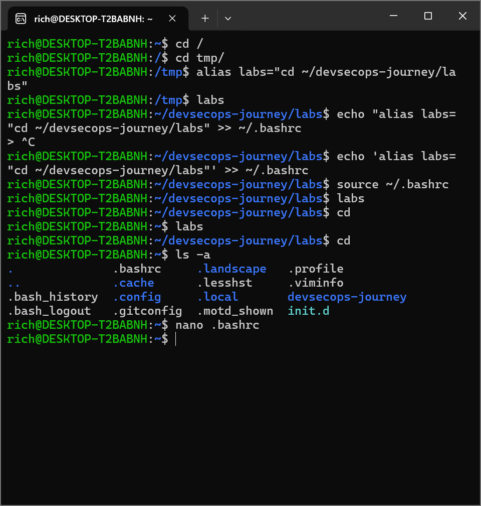

# Lab 06 —Deploiement d'alias

## Objectif

Saisir sans cesse de longues commandes et des noms de fichiers devient vite fastidieux et entraîne de nombreuses erreurs mineures, comme des fautes de frappe.

Le déploiement d'alias nous permet de définir des raccourcis pour atténuer la pénibilité de toute cette saisie.

Supposons que vous soyez membre d'une équipe projet travaillant dans un répertoire commun et partagé pour votre projet. Ce répertoire se trouve dans /home/staff/RandD/projects/projectX/src .

Lorsque vous travaillez sur le projet X, vous devez souvent créer et modifier des fichiers dans ce répertoire. Il ne faut pas longtemps avant de saisir : 

cd /home/staff/RandD/projects/projectX/src

Cela devient lassant.

Définissez et utilisez un alias nommé « projx » pour exécuter la commande cd ci-dessus à votre place.
## commandes executees

## alias labs="cd ~/devsecops-journey/labs"
commande pour creer l'alias <labs>

## labs
verification

## echo 'alias labs="cd ~/devsecops-journey/labs"'>> ~/.bashrc
commande pour rendre l'alias permanent, en le copiant dans le fichier <.bashrc>

