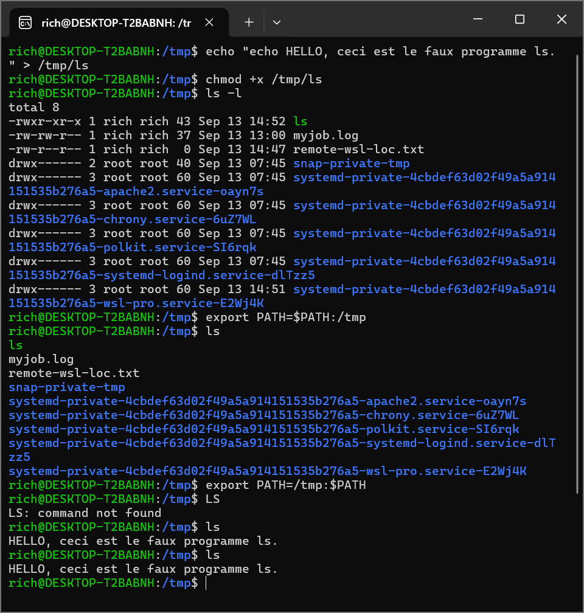

# Lab 06 —Deploiement d'alias

## Objectif
Créez un petit fichier  /tmp/ls contenant uniquement la ligne :

echo HELLO, ceci est le faux programme ls.

Ensuite, rendez-le exécutable en procédant comme suit :

chmod +x /tmp/ls

Ajoutez /tmp à votre variable d'environnement PATH afin qu'elle ne soit prise en compte qu'après votre variable d'environnement habituelle. Tapez ls et observez quel programme est exécuté : /bin/ls ou /tmp/ls ?
Ajoutez  /tmp au début de votre chemin d'accès afin qu'il soit pris en compte avant votre chemin habituel. Tapez à nouveau la commande ls  et observez quel programme est exécuté : /bin/ls ou /tmp/ls ?
Quelles sont les considérations de sécurité liées à une modification du tracé dans ce sens ?

## commandes executees
## echo "echo HELLO, ceci est le faux programme ls." > /tmp/ls
creation d'un fichier contenant cette ligne

## cat /tmp/ls
commande pour verifier que le fichier ls contient bien le script

## chmod +x /tmp/ls
pour accorder les droits d'execution au fichier(ls)

## export PATH=$PATH:/tmp
commande pour ajouter </tmp> tout a la fin de la variable d'env

## ls
premiere verification

## export PATH=/tmp:$PATH
commande pour ajouter </tmp> tout au debut de la variable d'env

## ls
doit lire et afficher le contenu du faux fichier <ls>,
la raison: en cherchant la commande ls, le shell commence par inspecter /tmp, il trouve un fichier executable nomme <ls> et il l'execute immediatement sans aller chercher plus loin.

## different moyen de remettre la variable d'env comme c'etait

## export PATH=/usr/local/sbin:/usr/local/bin:/usr/sbin:/sbin:/bin

## si on a pas encore enregistrer les modification dans notre fichier ~/.bashrc, on ferme tout simplement la fenetre et au redemarrage, tout sera nul.

## .bashrc
-Définir des alias (alias) :
Il permet de créer des raccourcis pour les commandes longues ou fréquentes (ex: alias labs="cd ~/devsecops-journey/labs" ou alias ll="ls -la").

-Configurer les variables d'environnement (export) :
Il sert à définir ou modifier des variables globales comme $PATH (les répertoires où Linux cherche les exécutables), $EDITOR (votre éditeur par défaut comme nano ou vim), ou des clés d'API.

-Personnaliser l'invite de commande (PS1) :
C'est ici qu'on modifie l'apparence du texte au début de la ligne de commande (couleurs, affichage du nom d'utilisateur, du nom de la machine ou de la branche Git actuelle).

-Automatisations au démarrage :
Il permet de lancer automatiquement des scripts, des fonctions personnalisées ou des messages d'accueil à chaque ouverture d'une session de terminal.