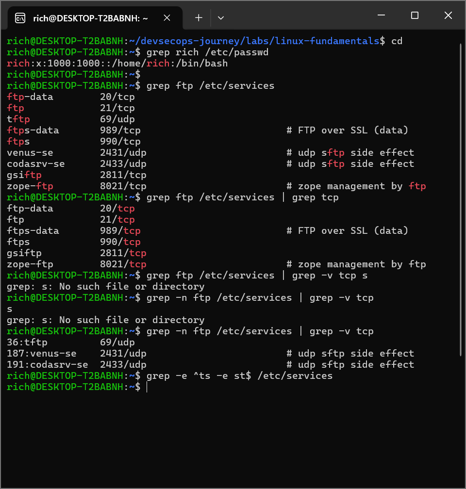

# Lab 06 —Utilisation de grep
## Objectif
Nous vous donnons ci-dessous quelques exemples de ce que vous pouvez faire avec la commande grep ; votre tâche consiste à expérimenter avec ces exemples et à les étendre.

Recherchez votre nom d'utilisateur dans le fichier /etc/passwd .
Trouvez toutes les entrées dans /etc/services qui incluent la chaîne f‌‌tp .
Limiter l'accès à ceux qui utilisent le protocole TCP.
Limitez maintenant l'affichage à ceux qui n'utilisent pas le protocole TCP, tout en affichant le numéro de ligne.
Récupérez toutes les chaînes qui commencent par ts ou se terminent par  st .

## commandes executees
## grep rich /etc/passwd
## grep ftp /etc/services
## grep ftp /etc/services | grep tcp
## grep -n ftp /etc/services | grep -v tcp s
## grep -e ^ts -e st$ /etc/services

